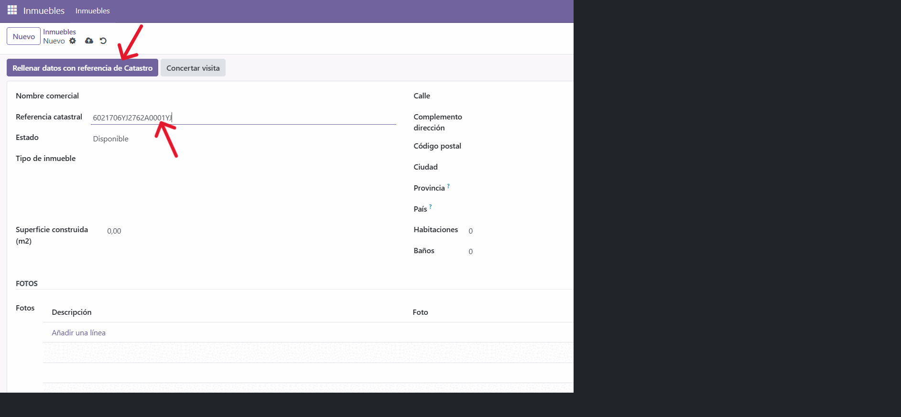

# Módulo inmo_odoo - Gestion de Inmuebles en Odoo 17

Módulo de Odoo para la gestión básica de inmuebles agilizando el proceso de obtención de información con ayuda de la API pública de la Sede Electrónica del Catastro. El módulo permite registrar la información de las propiedades, así como concertar visitas de clientes a las propiedades de manera sencilla.

## Características principales
- Catálogo de inmuebles con campos para identificación, localizacion, dimensiones y estado
- Gestión de tipos de inmueble y estados mediante modelos estándar de Odoo.
- Agenda de visitas con integración con el calendario de Odoo

## Requisitos
- Odoo 17 (Community o Enterprise)

## Instalación
1. Copia este módulo dentro de la carpeta de addons de tu instancia de Odoo.
2. Reinicia el servidor de Odoo para que detecte el nuevo módulo.
3. Activa el modo desarrollador en la interfaz de Odoo.
4. Desde Apps, actualiza la lista de aplicaciones y busca **Inmuebles**.
5. Instala el módulo como cualquier otro addon.

## Datos de demostración
- El módulo carga solo el archivo `demo/inmueble_demo.xml`, que crea varios inmuebles de ejemplo con campos básicos completados.

## Uso rápido
1. Accede al menú **Inmuebles** para ver la lista de propiedades.
2. Crea o edita inmuebles desde el formulario dedicado, completando los campos relevantes, o autorellenando con la referencia catastral del inmueble.
3. Programa visitas desde el boton de concertar visita en la vista de lista o kanban para un inmueble.
4. Puedes utilizar el campo de búsqueda y los filtros estándar de Odoo para localizar inmuebles.

## Instrucciones

Hay imágenes con instrucciones en la carpeta "Instrucciones" del módulo

